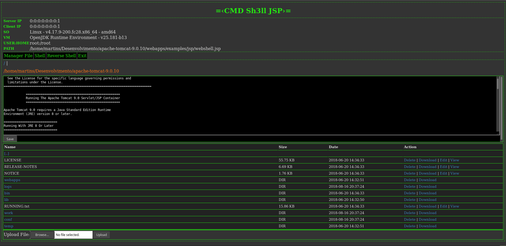

# Webshell para servidor web java.

Sistema para controlar o servidor web java através do navegador.

## Recursos

* Gerenciamento de arquivos
* Execução de comandos no sistema operacional
* Shell reverso

## Como usar

Acesso pelo navegador web

`http://url.servidor/webshell.jsp?token=password`
